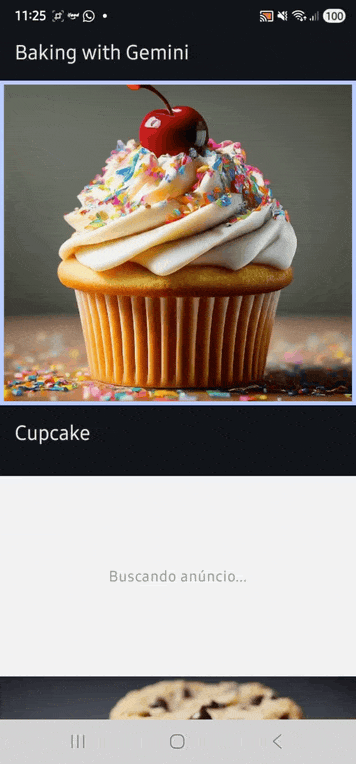

# AppTestGoogleAdManager 🚀

This project is a **Proof of Concept (PoC)** to demonstrate **Google Ad Manager** integration in a modern Android application, using **Jetpack Compose** and the **Custom Native Ads** format.

The main goal is to validate the display of the "Shortz" format (short videos) seamlessly integrated into a content list.

## 📱 Demo

| Shortz Video Integration |
|--------------------------|
|  |

> *Note: The GIFs above are illustrative for this documentation.*

---

## 🛠️ Technologies Used

- **Kotlin** & **Jetpack Compose**
- **Google Mobile Ads SDK (GAM)**: `com.google.android.libraries.ads.mobile.sdk:ads-mobile-sdk:1.1.0`
- **Firebase AI (Gemini)**: Used for image analysis features within the sample application context.
- **Coroutines & Flow**: For asynchronous state management.

## 🏗️ Implementation

### 1. SDK Initialization
The SDK is initialized in `MainActivity` using a placeholder application ID. Ad loading only starts after the successful initialization callback.

```kotlin
val initializationConfig = InitializationConfig.Builder("ca-app-pub-3940256099942544~3347511713")
    .build()

MobileAds.initialize(this, initializationConfig) {
    loadAd()
}
```

### 2. Custom Native Ad Manager
We created a `CustomNativeAdManager` to centralize the logic for:
- **Loading**: Configuring the `NativeAdRequest` with `customFormatId` and `customTargeting`.
- **Rendering**: Inflating the XML layout (`layout_custom_native_ad.xml`) and binding ad assets (Headline, Body, MediaContent).
- **Video Support**: Using `MediaView` to render Shortz video content, with autoplay control.

### 3. Jetpack Compose Integration
Ads are displayed within a `LazyColumn` in `BakingScreen`. We use `AndroidView` to integrate the native SDK component:

```kotlin
AndroidView(
    factory = { ctx ->
        CustomNativeAdManager().displayVideoCustomNativeAd(ad, ctx)
    },
    modifier = Modifier.fillMaxWidth().aspectRatio(aspectRatio)
)
```

## 🎨 Ad Display Format Configurations

The project explores different ways to control how the ad occupies screen space. Each option is a trade-off between fidelity to the original content and predictability of the layout.

---

### 1. Fixed Local Aspect Ratio

**Where:** `BakingScreen.kt` — `AD_DISPLAY_RATIO` constant and `Modifier.aspectRatio()`

```kotlin
private const val AD_DISPLAY_RATIO = 9f / 16f

Modifier
    .fillMaxWidth()
    .aspectRatio(AD_DISPLAY_RATIO)
```

The container is locked to a specific ratio (e.g. 9:16 portrait) regardless of the video's native ratio. The layout is always predictable and does not shift when the ad loads. The trade-off is that the video content may not fill the space perfectly without additional scaling.

---

### 2. Center-Crop (cropToFill)

**Where:** `CustomNativeAdManager.displayVideoCustomNativeAd()` — `cropToFill` parameter + `applyCenterCropScale()`

```kotlin
CustomNativeAdManager()
    .displayVideoCustomNativeAd(ad, context, cropToFill = true)
```

When `cropToFill = true`, the `MediaView` is scaled uniformly so that the video fills the container entirely, cropping the overflow. The container must have `clipChildren = true` (or `Modifier.clipToBounds()` on the Compose side) to hide the cropped excess.

- **Use with fixed ratio:** combines with option 1 to guarantee a full-bleed video in a predictable container.
- **Scale logic:** scales by height when the video is wider than the container, and by width when it is taller.

---

### 3. Letterbox / Default (cropToFill = false)

**Where:** `CustomNativeAdManager.displayVideoCustomNativeAd()` — default behavior

```kotlin
CustomNativeAdManager()
    .displayVideoCustomNativeAd(ad, context, cropToFill = false)
```

The `MediaView` preserves the video's native aspect ratio. When the container ratio differs, black bars appear (letterbox or pillarbox). No content is cropped; the full frame is always visible.

---

### 4. Dynamic Aspect Ratio (Fluid)

**Where:** `CustomNativeAdManager` — reads `mediaContent.aspectRatio`

```kotlin
val videoAspectRatio = mediaContent.aspectRatio.takeIf { it > 0f } ?: (16f / 9f)
```

The container adapts to the ratio reported by the ad server. Each ad can have a different ratio, so the layout height changes per item. Less predictable for the feed but ensures pixel-perfect fidelity with no cropping.

---

### 5. Static Image Fallback

**Where:** `CustomNativeAdManager.displayVideoCustomNativeAd()` — `else` branch when `mediaContent == null`

```kotlin
val mainImage = customNativeAd.getImage("MainImage") ?: customNativeAd.getImage("mainImage")
```

When the ad carries no video (`mediaContent` is `null`), the manager falls back to a static image asset (`MainImage`). The image is rendered with `adjustViewBounds = true` so it wraps to its own height.

---

### 6. Video Autoplay and Loop

**Where:** `CustomNativeAdManager` — `VideoController.VideoLifecycleCallbacks`

```kotlin
videoController?.videoLifecycleCallbacks = object : VideoController.VideoLifecycleCallbacks {
    override fun onVideoEnd() { videoController.play() }
}
// Deferred play — runs after the Surface is ready to avoid a black first frame.
adView.tag = Runnable { videoController?.play() }
view.post { (view.tag as? Runnable)?.run() }
```

Play is deferred via `View.post()` so the `MediaView` Surface is ready before the first frame is rendered (avoids a black flash). `onVideoEnd()` restarts playback to create a seamless loop.

---

## 📋 Implemented Features

- [x] Google Mobile Ads SDK initialization.
- [x] Loading multiple custom native ads.
- [x] Custom Targeting support (`tvg_pos: SHORTZ`).
- [x] MediaContent (Video) rendering with dynamic aspect ratio.
- [x] Impression and Click tracking.
- [x] Loading placeholder while the ad is not ready.

## 🚀 How to Run

1. Clone the repository.
2. Ensure you have the `google-services.json` file (if required for Firebase).
3. Sync Gradle.
4. Run the app on an emulator or physical device.

---
Developed as a technical reference for Google Ad Manager implementations.
